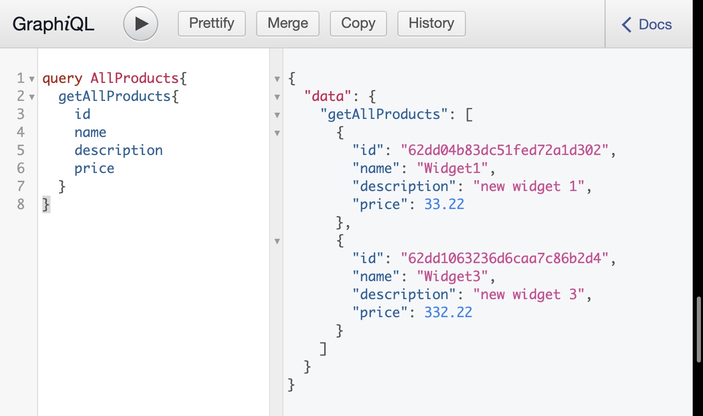
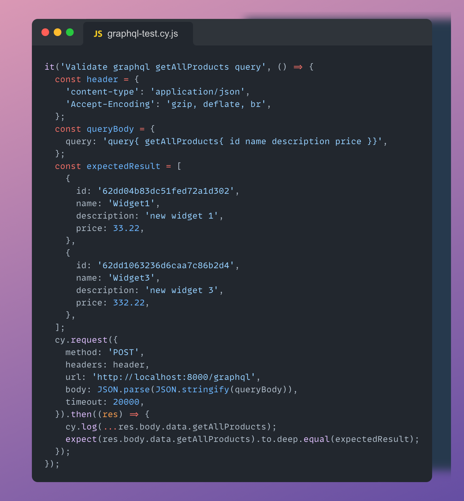
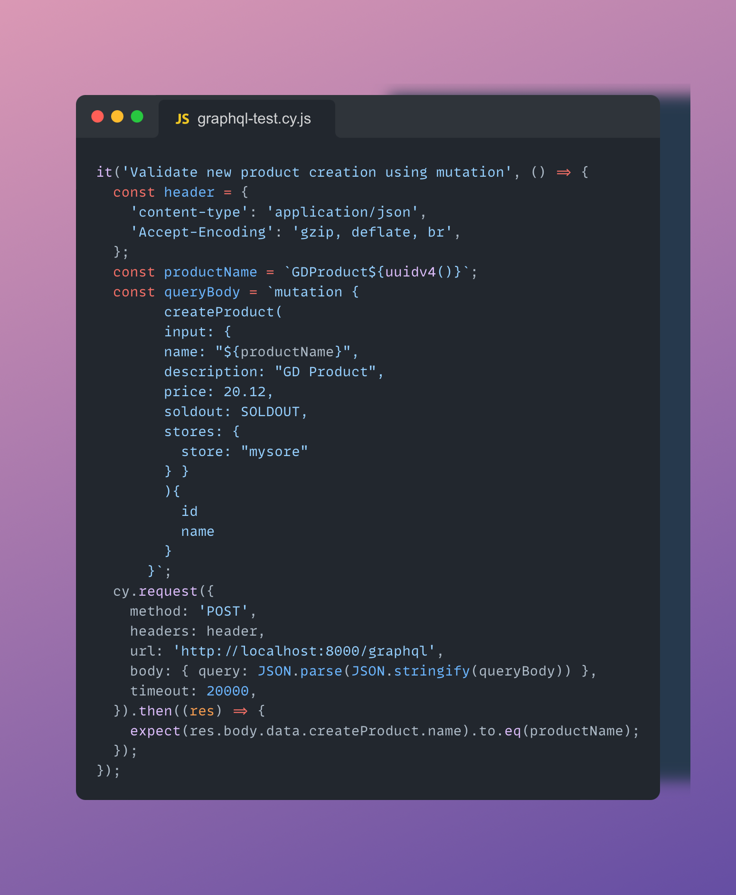

# Cypress: Introduction to Graphql Testing

## What is Graphql

Graphql is a query language for APIs which allows us to query to get exactly what we need in the response data.

More about graphql basics can be found https://graphql.org/code/#javascript

#### Parts of Grapqhl request body

A typical graphql request body contains

1. query : Specifying what all the data we need in response body
2. mutation : To create new data
3. variables : To pass dynamic values
4. operation name : To specify what operation the query is performing, this also comes handy when we have to execute multiple queries

## Writing our first test to query data from graphql endpoint

A sample get query would look like below, where we are fetching all the Products and we need products id, name, description and price in the response. Hence we are passing these details in the getAllProducts query

Now if we need to write our cypress test for the above example, it will look like

### Mutation to create new entity

In REST we use POST method to create a new entity but in Graphql we have to use mutation to create a new entity and the sample graphql mutation to create new product looks like below

Let's test this by writing a cypress test

As we can see only the body has been changed, where we are using mutation to pass the details for creating new product and rest of the request parameters remains same.
In graphql the status code is 200 always, hence we need to rely on validating the response body. In the above test, we are validating the newly created Product Name which is returned as part of response body upon successful Product creation.

### For starting graphql application and test, perform below steps
1. npm install
2. install mongo db and start the server
3. npm start
4. npx cypress open
